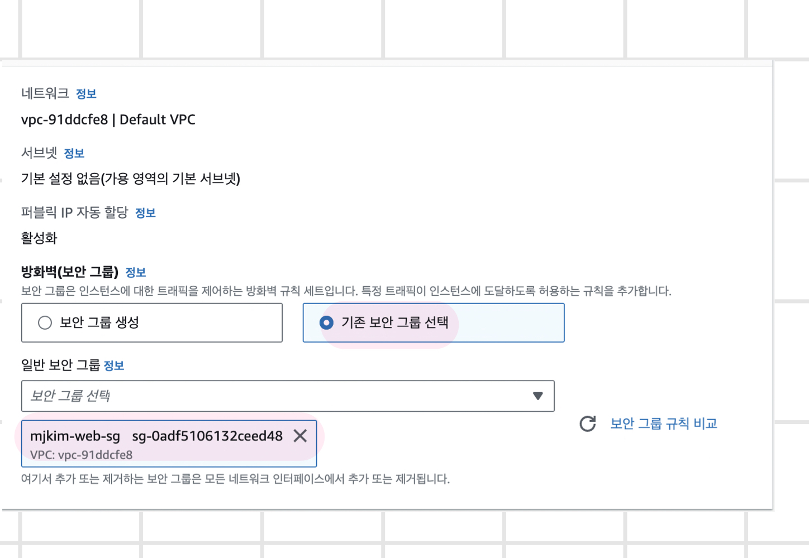

# Cloud Computing

## 클라우드 컴퓨팅의 논리적 3계층
- IaaS : Infrastructure as a Service / 가상 컴퓨터 스토리지 네트워크
- PaaS : Platform as a Service / 응용 프로그램의 개발을 돕는 플랫폼
- SaaS : Software as a Service / 사용자에게 제공되는 소프트웨어 또는 서비스를 가상화하여 제공

## 그 외 계층(XaaS)
- BaaS(Backend as a Service), FaaS(Function as a Service), CaaS(Container as a Service), SECaaS(Security as a Service)
- FaaS : 서버리스 아키텍처 구성을 위한 서비스 ➡️ AWS Lambda, Azure Functions
- CaaS : 컨테이너 환경을 위한 서비스 ➡️ AWS EKS, AWS ECS, AWS Fargate...

## 서비스 유형
- 퍼블릭 클라우드 : 클라우드 공급자(CSP)에게 제공받아 쓰는 방식
- 프라이빗 클라우드 : 단일 비즈니스 또는 조직에서 독점적으로 제공되는 서비스
- 하이브리드 클라우드

## 하이퍼바이저(Hypervisor)
- 가상머신(Virtual Machine, VM)을 생성하고 구독하는 소프트웨어
- 가상머신모니터(Virtual Machine Monitor, VMM)라고 불림
- 운영체제와 가상 머신의 리소스를 분리해 VM의 생성과 관리를 지원
- 오래전부터 있던 기술!

## 클라우드 컴퓨팅 서비스 프로바이더
- 글로벌 벤더 : AWS / Azure / GCP...

## AWS 보안 : 공동 책임 모델(Separation of Responsibilities)
- AWA 책임 '클라우드의 보안' : PaaS / SaaS
- 고객 책임 '클라우드에서의 보안' : On-Premisese / IaaS / 데이터 활용 레벨

## AWS 서버 격리(Instance Isolation)
- DOD(미국 국방부) / NIST 표준 준수

## SLA(Service Level Agreement) : 사용자 약관
- AWS 클라우드 서비스의 안정성은 SLA 99.95%로 정의되어 있다(평균적 수치 / 실제로는 서비스마다 다름)
- 0.05%의 장애가 발생할 수 있다
- ➡️ 장애가 발생해도 괜찮도록 설계해야 한다❗️

## AWS 구축 절차
- VPC : AWS 클라우드 내 구축하는 가상의 네트워크 영역(데이터센터)
- VPN : On-prem 데이터 센터와 VPC 간에 VPN(IPSec) 연결
- Direct Connect : On-prem 데이터 센터와 VPC의 전용선 연결
- ELB : 관리형 Load Balancer 서비스
- Route 53 : 관리형 DNS 서비스

## 가용 영역(Availability Zone)

## AWS 보안 아키텍처 구현 기본 요소
- 멀티 레이어 보안 아키텍처를 통한 다차원 대응
- 사용자 보안 : IAM - 클라우드 보안의 기본 요소, 사용자 계정 관리
  - 인증 / 보안 상식 ✨
  - Multi-factor Authentiacation(MFA) : Knowledge(Type1) / Possession(Type2) / Biometric(Type3)
  - MFA의 기본은 다른 타입 두 가지를 합치는 것!
- 네트워크 보안 : VPC : 사용자 정의 가능한 논리적 네트워크 환경
  - 접근 제어
    - SG(Security Group / 인스턴스 보안 / 방화벽 / 기본 차단)
    - ACL(Access Control List / 네트워크 보안 / NACL(Network ~) / 차단 목적 / 기본 허용 : 모든 차단은 SG에서 해주기 때문에)
  - 가용성
    - AS(Auto-Scaling / 이중화)
- 서버 보안 : SG, EC2(linux)
- 서비스 보안 : (nginx)
- 가용성 : Route53, ELB, AutoScaling

## VPC 설정을 위한 네트워크 101 복습❗️ - [IPv4 주소 체계](https://xn--3e0bx5euxnjje69i70af08bea817g.xn--3e0b707e/jsp/resources/ipv4Info.jsp)
- [✨ RFC 1918](https://datatracker.ietf.org/doc/html/rfc1918)
- IP(Internet Protocol) : **고유한** 서버의 주소
- IPv4 : 32비트 주소 체계 ➡️ 0.0.0.0 ~ 255.255.255.255 ➡️ 약 42억개
  - class A / B / C / D / E
  - 네트워크 대역 : 서브넷(subnet) / 서브넷 마스크
  - 클래스 16 / 클래스 24... 1의 개수로 표시하기도 함
  - 네트워크 아이디(고정값) / 호스트 아이디(가변)
  - 공인 IP / 사설 IP 체계
    - 클래스 별로 사설 IP 대역이 있음 : class A - 10.0.0.0 / B - 172.16.0.0 / C - 192.168.0.0...
  - Special 대역도 있다
- IPv6 : IPv4의 고갈로 모바일은 IPv6 ➡️ 128비트 주소 체계

## Lightsail
- 기술 지식이 제한된 사람들도 쉽게 사용할 수 있도록 설계됨

~~~shell
cd stack
cd nginx/html
echo "<h1> Welcome to LightSail from mjkim </h1>" > index.html
~~~

### 내 터미널에서 원격 서버에 접속 : ssh(secure shell)
- ssh <계정명>@<서버IP>
- ssh -i <키파일> <계정명>@<서버IP>
- Bitnami (nginx 웹서버를 만든 회사 이름) / LAMP(Linux + Apahche + MySQL + PHP)
- 클라우드에서는 id/pw(Type1) 사용하지 않음 : 보안에 취약하기 때문에 Type2를 이용해서 인증함 / .pem : 개인키 파일 확장자 ➡️ compromised 된 키는 폐기해야 함
- [scp manual](https://linux.die.net/man/1/scp)
~~~zsh
chmod 600 LightsailDefaultKey-ap-northeast-2.pem
# 파일 복사하기 / 복사할 파일이 있는 폴더 안에서!
scp -i ~/downloads/LightsailDefaultKey-ap-northeast-2.pem hello.py bitnami@3.35.0.6:/home/bitnami
# scp -r(recursive)
# 폴더 통째로 복사하기 / 복사할 폴더 안에서!
scp -r -i ~/downloads/LightsailDefaultKey-ap-northeast-2.pem . bitnami@3.35.0.6:/home/bitnami
ssh -i LightsailDefaultKey-ap-northeast-2.pem bitnami@3.35.0.6
sudo apt update
sudo apt install python3-pip
pip install flask

# 다른 터미널에서 
curl localhost:5000
~~~

- SG = 보안그룹(방화벽)을 열어주지 않으면 실행되지 않음
  - manage > Networking > IPv4 Firewall > create
  - Flask 파일에서 아래와 같이 수정(누구든지 접속 가능하도록)
    ~~~python
    if __name__ == "__main__":
      app.run(host="0.0.0.0")
    ~~~
  - 다시 파일 복사 후 다시 **실행**

## 보안계층
- 클라우드(SG)
- OS(iptables/netfilter/network/socket)
- Application(socket요청시옵션/인증/인가)

~~~zsh
# 서버에 접속한 사람 알아보기
sudo lastb
# 패스워드를 쓰지 않으므로 이 서버는 절대로 뚫리진 않음
~~~

## AWS 비용
- PATG(Pay as you go)
- 프리티어
- 온디맨드 요금 : 필요할 때 필요한 만큼 / 분단위(60초)로 과금

### 서버 유형
1. EC2(Elastic Compute Cloud) 인스턴스 유형
   1. t2 계열 : 범용 / t3a : amd 메모리, 나머지 : intel
   2. m5 계열 : 메모리
   3. c5 계열 : 컴퓨팅
   4. r5 계열 : 메모리(데이터베이스)

2. RDS(Relational Database Service) 인스턴스 유형
3. ECS(Elastic Containter Service) 인스턴스 유형

### 국가별 차이
- 임대료, 전기세, 인건비 등의 차이 때문에 국가별로 가격이 다름
- 레이턴시 차이 있음

### 고정 IP
- 사용하지 않으면 비용 부과(IP 낭비하는 것이기 때문에)

### 데이터 저장소(EBS - EC2에 붙는 storage)
- 용량만으로 가격이 결정되지 않음 ➡️ 성능❗️
- 데이터를 얼마나 썼느냐에 따라서도 과금 ➡️ HDD, SSD 등등은 소모품이기 때문에
- 결론 : 처리 속도가 빠를수록 비싸다❗️

### ✨ 결론 : 컴퓨팅 파워(CPU/메모리) + 스토리지 + 데이터 전송 + 기타(IP) ➕ 쓴만큼 낸다
<!--  -->

## EC2
### 인스턴스 생성

 
- 리눅스보다 윈도우가 비싸고 보편적으로 우분투 많이 씀
- 우분투 22.04가 기본 값 / 우리 수업에서는 20.04를 쓸 것임 
 
- 이론적으로는 서버마다 하나의 key를 쓰는게 좋지만 업무상 나의 PC 당 하나의 key를 쓰는 게 더 좋다
- 개인키 카톡방 공유 : 잘못된 것 ➡️ 계정 따로따로 관리(리눅스 수업 때 배울 예정)
- 이 key가 탈취 도난 방지하기 위한 방안이 없으면 ssh같은 접속해주는 소프트웨어들이 싫어한다(신뢰 할 수 없다고 하기도 함)
  - 안전한 공간 : 윈도우 ➡️ c:\users\(맥북도 리눅스도 다른 사용자가 접근 못하도록 권한 설정 할 수 있음) 

 
- 원래 VPC, AZ, Subnet, Route, IGW 등 직접 설정해야하지만 default 설정 있음 ➡️ 우리 수업 땐 default로 쓸 것임 

### (새 창!)보안 그룹 생성
- 보안 그룹 만들기 ➡️ **새 창**에서! 

 
- 인바운드 규칙 : 소스 유형 ➡️ 보안적으로는 내 IP가 좋다
  - 우리 수업 땐 학습적인 목적으로 Anywhere-IPv4
  - 설명은 써두는 것이 좋은 습관!(뭔지 나중에 알기 편하게 하려고) 
 
- 아웃바운드는 나가는 것은 다 허용해주는 것이 기본 값 ➡️ 웬만하면 손대지 않는 것이 좋음 
 
- 태그 : 안 넣어도 되지만 넣는 것이 좋은 습관! 
 

### 다시 인스턴스 생성 창으로 돌아와서

 
- 스토리지 : 지금은 기본값(8GB) 그대로 사용할 것임 
 
- 인스턴스 시작 버튼 클릭하면 생성 완료! 
 

### 인스턴스 정보 확인 창
 

- 아이디
  - 우분투 : ubuntu
  - AmazonLinux : ec2-user
  - Redhat : root
### 터미널에서 서버로 접속(공인IP)
~~~zsh
# 내 키가 있는 경로로 들어가서!
ssh -i mjkim-key.pem ubuntu@3.92.243.189
~~~

### 웹 콘솔
  - 웹 콘솔로 들어갈 수도 있는데 우리 수업에서는 권한 설정 안하셨음 
 
 

- 인스턴스 유형 확인 
 

### 서버 관리
- 껐다 킬 때마다 IP 주소가 달라짐
- 인스턴스 종료 : 폐기❗️❗️❗️ 중지와 다름❗️❗️❗️ ➡️ 종료방지기능 활성화 
 
 
 

- 종료 동작 변경 : 운영체제가 종료될 때의 행동을 정함 ➡️ OS 종료할 때 ➡️ 중지 // 종료로 바꾸면 ➡️ 서비스 자체가 폐기됨
  - 굳이 건드릴 필요가 없다❗️
 
 
- 중지 방지 변경 : 중지 방지 기능(활성화할 일이 거의 없음)

### 터미널에서 서버 상태 보기
- 서버 실행 후
~~~zsh
# 고전적 서버 상태 보기
top
# 요즘 서버 상태 보기
# GUI 버전이라서 클릭도 됨
htop
# 종료 : q, f10

# cpu 정보 보기
cat /proc/cpuinfo
# processor	: 0 ➡️ CPU 하나일 때
~~~
- htop 실행된 화면 
 

### scale-up❗️ & scale-down
- aws 인스턴스 상태에서 인스턴스 중지 ➡️ 좀 기다리면 인스턴스 상태 : 중지됨 확인 가능 ➡️ 인스턴스 유형 변경 활성화 됨 
 
 
 
- t2 medium으로 변경 후 : htop 명령어를 통해 CPU 2개에 메모리 4기가 된 것 확인 가능 
 
- t3a small로 변경 후 : cat /proc/cpuinfo를 통해 AMD 확인 
 