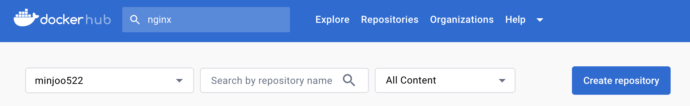
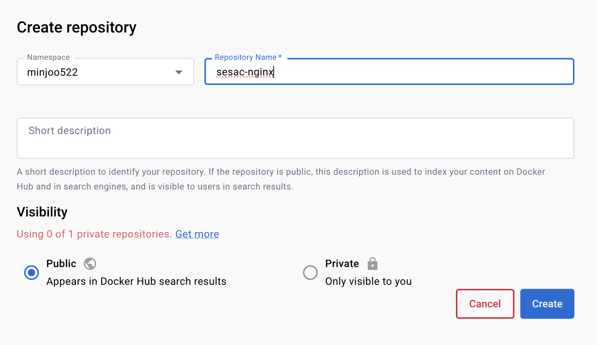
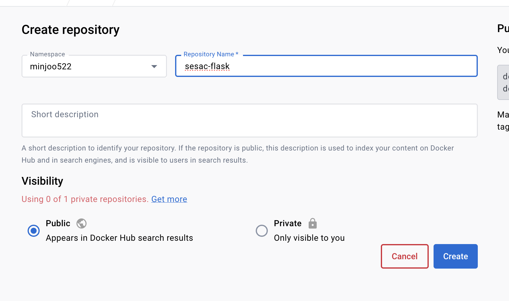

# Docker 3️⃣ 🐳
- 컨테이너는 리눅스 커널의 기술
- 도커는 컨테이너 활용 에코시스템(생태계) 구축으로 유명해짐
- 애플리케이션 격리(namespace)
  - 프로세스 격리, 네트워크 격리, 파일시스템 격리, 사용자 격리, 호스트네임(uts) 격리 등등
- docker run = pull + create + start
- docker images
- docker ps(ps -a, container ls, container ls -a)
~~~bash
docker run
-d
-p <host port>:<container port>
-v <host path>:<container path>
-v volume name:<container path>
-e <환경변수=값>
--name <container name>
~~~
- docker rm / rm -f / rm -f $(docker ps -aq)
- docker rmi / docker rmi -f $(docekr images -a)
- docker volume ls / docker volume create my-db

## 우리의 어플리케이션 빌드
- Dockerfile
- docker build .(current dir / Dockerfile을 찾아서 빌드)
- docker build -f my-file.docekrfile(파일)
- docker build -t myapp:0.1 .(태그)
- 모든 이미지는 다른 이미지를 기반으로 만들어진다
- 우리가 만들 이미지의 첫 출발점(베이스 이미지)
- FROM alpine / alpine linux, 경량화된 이미지, 우분투(데비안) 명령어들이 동작하지 않음
- FROM slim / debian 계열에서 경량화된 이미지
- FROM python:3.8 . 1GB 가까이되는 이미지(파이썬의 다양한 기본 라이브러리 모두 탑재)
- FROM python:slim
- 나에게 적합한 것을 찾는 것도 중요하다!

## dockerignore
- .dockerignore : 이미지를 빌드할 때 원치않는 파일 포함 방지
- .dockerignore / Dockerfile / *.bak / *.pyc / \__pycache__ 등등

## CMD
- ENTRYPOINT와 흡사
- CMD ["echo", "hello, world"]
- ENTRYPOINT : 강제 실행
- CMD : 옵셔널하게 실행됨
- ex) docker run nginx bash를 실행해도 ENTRYPOINT가 있는 경우 무조건 ENTRYPOINT가 실행되기 때문에 bash 실행 불가
- ENTRYPOINT와 CMD 둘 다 실행 가능
~~~dockerfile
ENTRYPOINT ["python"]
CMD [app.py]
~~~
~~~bash
docker run myapp
# python app.py 실행
docekr run myapp bash
# python bash 실행
docker run myapp app2.py
# python app2.py 실행
~~~

## latest 태그 붙여주기
~~~bash
ubuntu@ip-172-31-39-149:~/sesac$ docker tag myapp:1.0 myapp:latest
ubuntu@ip-172-31-39-149:~/sesac$ docker images
REPOSITORY   TAG       IMAGE ID       CREATED        SIZE
myapp        1.0       f1bec6cde7aa   41 hours ago   1.01GB
myapp        latest    f1bec6cde7aa   41 hours ago   1.01GB
~~~

## 리버스 프록시
- 나는 프록시 중개하는 역할 뒤에 있는 다른 애들한테 전달
~~~bash
# 로컬의 nginx 다시 키기
ubuntu@ip-172-31-39-149:/var/www/html$ sudo systemctl start nginx
# 이전에 권한 바꿔 놓은 것 때문에 안 보여서 권한 다시 설정
ubuntu@ip-172-31-39-149:/var/www/html$ sudo chown -R root:www-data .
ubuntu@ip-172-31-39-149:/var/www/html$ cat /etc/group | grep www-data
www-data:x:33:
# 나도 접근 가능해야 하니까 그룹에 넣어주기
ubuntu@ip-172-31-39-149:/var/www/html$ sudo usermod -aG www-data ubuntu
~~~

~~~bash
# alias 생성
ln -s /etc/nginx/sites-available/sesac sesac
ubuntu@ip-172-31-39-149:/etc/nginx/sites-enabled$ ls -al
drwxrwxr-x 2 root   developers 4096 Sep  4 02:11 .
drwxrwxr-x 8 root   developers 4096 Aug 29 14:42 ..
lrwxrwxrwx 1 root   developers   34 Aug 29 14:42 default -> /etc/nginx/sites-available/default
lrwxrwxrwx 1 ubuntu www-data     32 Sep  4 02:11 sesac -> /etc/nginx/sites-available/sesac

ubuntu@ip-172-31-39-149:/etc/nginx/sites-available$ ls -al
drwxrwx--x 2 root developers 4096 Sep  4 02:20 .
drwxrwxr-x 8 root developers 4096 Aug 29 14:42 ..
-rwxrwx--x 1 root developers 2416 Mar 26  2020 default
-rwxrwx--x 1 root developers  326 Sep  4 02:21 sesac
~~~

~~~bash
📂 sesac
# 경로의 제일 끝에 '/'를 붙여 주어야 함!
server {
  listen 8000 default_server;

  location / {
    proxy_pass http://127.0.0.1:5001/;
  }

  location /user {
    proxy_pass http://127.0.0.1:5002/;
  }

  location /admin {
    proxy_pass http://127.0.0.1:5003/;
  }
}
~~~

~~~bash
# 적은 거 이상 없는지 확인
ubuntu@ip-172-31-39-149:/etc/nginx/sites-available$ sudo nginx -t
nginx: the configuration file /etc/nginx/nginx.conf syntax is ok
nginx: configuration file /etc/nginx/nginx.conf test is successful
ubuntu@ip-172-31-39-149:/etc/nginx/sites-available$ docker run -d -p 5001:5000 -e APP_COLOR=green --name myapp-green myapp:latest
ubuntu@ip-172-31-39-149:/etc/nginx/sites-available$ docker run -d -p 5002:5000 -e APP_COLOR=orange --name myapp-orange myapp:latest
ubuntu@ip-172-31-39-149:/etc/nginx/sites-available$ docker run -d -p 5003:5000 -e APP_COLOR=red --name myapp-red myapp:latest

ubuntu@ip-172-31-39-149:/etc/nginx/sites-available$ sudo systemctl restart nginx
~~~
- 8000/, 8000/user, 8000/admin 다 다른 배경 색깔 볼 수 있음

## 로드 밸런싱
- AWS EC2의 ELB도 같은 역할을 한다

~~~bash
📂 sesac
upstream my-apps {
  server 127.0.0.1:5001;
  server 127.0.0.1:5002;
  server 127.0.0.1:5003;
}

server {
  listen 8000 default_server;

  location / {
    proxy_pass http://my-apps;
  }
}
~~~
~~~bash
sudo systemctl reload nginx
~~~
- 8000번 경로로 들어가면 배경색 세 가지 화면이 refresh 되는 것이 보임!

## 백업
~~~bash
📂 sesac
upstream my-apps {
  server 127.0.0.1:5001;
  server 127.0.0.1:5002 backup;
}

server {
  listen 8000 default_server;

  location / {
    proxy_pass http://my-apps;
  }
}
~~~
~~~bash
ubuntu@ip-172-31-39-149:/etc/nginx/sites-available$ sudo nginx -t
nginx: the configuration file /etc/nginx/nginx.conf syntax is ok
nginx: configuration file /etc/nginx/nginx.conf test is successful
ubuntu@ip-172-31-39-149:/etc/nginx/sites-available$ sudo systemctl reload nginx
ubuntu@ip-172-31-39-149:/etc/nginx/sites-available$ docker ps
CONTAINER ID   IMAGE          COMMAND           CREATED          STATUS          PORTS                                       NAMES
b7e4277fcb54   myapp:latest   "python app.py"   16 minutes ago   Up 16 minutes   0.0.0.0:5003->5000/tcp, :::5003->5000/tcp   myapp-red
4d6a51d0dba4   myapp:latest   "python app.py"   16 minutes ago   Up 16 minutes   0.0.0.0:5002->5000/tcp, :::5002->5000/tcp   myapp-orange
f0573d54915d   myapp:latest   "python app.py"   16 minutes ago   Up 16 minutes   0.0.0.0:5001->5000/tcp, :::5001->5000/tcp   myapp-green
ubuntu@ip-172-31-39-149:/etc/nginx/sites-available$ docker stop myapp-green
myapp-green
ubuntu@ip-172-31-39-149:/etc/nginx/sites-available$ docker start myapp-green
~~~

## 백업이 두 개인 경우?
~~~bash
📂 sesac
upstream my-apps {
  server 127.0.0.1:5001;
  server 127.0.0.1:5002 backup;
  server 127.0.0.1:5003 backup;
}

server {
  listen 8000 default_server;

  location / {
    proxy_pass http://my-apps;
  }
}
~~~
- 5002, 5003 두 개가 로드밸런싱 됨

### 뜨는 횟수 설정 가능
~~~bash
📂 sesac
upstream my-apps {
  server 127.0.0.1:5001;
  server 127.0.0.1:5002 weight=3;
  server 127.0.0.1:5003 weight=5;
}

server {
  listen 8000 default_server;

  location / {
    proxy_pass http://my-apps;
  }
}
~~~
- 5001이 한 번 뜰 때 5002 3번 ...

## 퀴즈
1. 우리의 nginx 컨테이너를 
### 방법 1
~~~bash
ubuntu@ip-172-31-39-149:~/sesac/4.total$ docker run -d -p 8000:80 -v /home/ubuntu/sesac/4.total/nginx/sesac:/etc/nginx/conf.d/default.conf nginx
179f84db060546cea8cd8a291d08a03b3a4e885408e6669dd4fc093a37d2407d
ubuntu@ip-172-31-39-149:~/sesac/4.total$ docker ps -a
CONTAINER ID   IMAGE     COMMAND                  CREATED         STATUS         PORTS                                   NAMES
179f84db0605   nginx     "/docker-entrypoint.…"   9 seconds ago   Up 8 seconds   0.0.0.0:8000->80/tcp, :::8000->80/tcp   serene_kilby
ubuntu@ip-172-31-39-149:~/sesac/4.total$ curl localhost:8000
curl: (52) Empty reply from server
ubuntu@ip-172-31-39-149:~/sesac/4.total$ docker run -d -p 5001:5000 -e APP_COLOR=green --name myapp-green myapp:latest
# 컨테이너는 격리되어 있는 환경으로 nginx에서 127.0.0.1은 컨테이너 자기 자신을 가리킴
~~~

~~~bash
📂 sesac
server {
  listen 8000 default_server;

  location / {
# docker inspect <컨테이너id>로 my-app green ip 찾아서 입력
    proxy_pass http://172.17.0.3:5000/;
  }
}
~~~

~~~bash
# nginx ip
ubuntu@ip-172-31-39-149:~/sesac/4.total$ docker run -d -p 8000:8000 --name my-nginx -v /home/ubuntu/sesac/4.total/nginx/sesac:/etc/nginx/conf.d/default.conf nginx
~~~
- 🚨 ip가 어떻게 될지 모름!

~~~bash
server {
  listen 8000 default_server;

  location / {
    proxy_pass http://myapp-green:5000/;
  }
}
~~~

~~~bash
docker run -d -p 8000:8000 --link myapp-green:myapp-green --name my-nginx -v /home/ubuntu/sesac/4.total/nginx/sesac:/etc/nginx/conf.d/default.conf nginx
~~~
- 🚨 그린이 없는 경우 연결 ❌

### 방법 2

~~~bash
📂 sesac
server {
  listen 8000 default_server;

  location / {
    proxy_pass http://myapp-green:5000/;
  }
} 
~~~

~~~dockerfile
FROM ubuntu:20.04

RUN apt update &&\
    apt install nginx -y

# nginx 컨테이너의 default의 내용을 sesac 파일이 대체
COPY sesac /etc/nginx/sites-available/default

CMD ["nginx", "-g", "daemon off;"]
~~~

~~~bash
docker build . -t my-nginx:1.0
docker run -d -p 5001:5000 -e APP_COLOR=green --name myapp-green myapp:latest
~~~

### 로드밸런싱
~~~bash
upstream my-apps {
  server myapp-green:5000;
  server myapp-orange:5000;
  server myapp-red:5000;
}

server {
  listen 8000 default_server;

  location / {
    proxy_pass http://my-apps;
  }
}
~~~

~~~bash
docker build . -t my-nginx:2.0
ocker tag my-nginx:2.0 my-nginx:latest
docker run --link myapp-green:myapp-green --link myapp-orange:myapp-orange --link myapp-red:myapp-red -p 8000:8000 -d --name my-nginx my-nginx
~~~

## 도커 커밋
- 도커 허브 ➡️ 로그인
- 레파지토리 생성

~~~bash
# 태그 맞춰 주어야 함
ubuntu@ip-172-31-39-149:~/sesac/4.total/nginx$ docker images
REPOSITORY              TAG        IMAGE ID       CREATED             SIZE
my-nginx                latest     3d4570a51289   11 minutes ago      178MB
minjoo522/sesac-nginx   latest     3d4570a51289   11 minutes ago      178MB
myapp                   latest     71c5f6b99b2f   4 hours ago         139MB
minjoo522/sesac-flask   latest     71c5f6b99b2f   4 hours ago         139MB

ubuntu@ip-172-31-39-149:~/sesac/4.total/nginx$ docker tag my-nginx:latest minjoo522/sesac-nginx:latest
ubuntu@ip-172-31-39-149:~/sesac/4.total/nginx$ docker tag myapp:latest minjoo522/sesac-flask:latest
ubuntu@ip-172-31-39-149:~/sesac/4.total/nginx$ docker login
ubuntu@ip-172-31-39-149:~/sesac/4.total/nginx$ docker push minjoo522/sesac-flask:latest
ubuntu@ip-172-31-39-149:~/sesac/4.total/nginx$ docker push minjoo522/sesac-nginx:latest
~~~
- 아래와 같이 pull해서 접속 가능!
~~~bash
docker run -d -p 5001:5000 -e APP_COLOR=green --name myapp-green minjoo522/sesac-flask
docker run -d -p 5002:5000 -e APP_COLOR=orange --name myapp-orange minjoo522/sesac-flask
docker run -d -p 5003:5000 -e APP_COLOR=red --name myapp-red minjoo522/sesac-flask
docker run --link myapp-green:myapp-green --link myapp-orange:myapp-orange --link myapp-red:myapp-red -p 8000:8000 -d --name my-nginx minjoo522/sesac-nginx
~~~

## Docker-compose
- 우리가 정의한 명령어를 설정파일로 관리하자
~~~bash
ubuntu@ip-172-31-39-149:~/sesac/4.total/nginx$ sudo apt install docker-compose
~~~
- 파일 이름은 docker-compose.yaml
  - yaml : yet another markup-language
~~~yaml
# 📂 docker-compose.yaml
version: '3'

services:
  myapp-green:
    image: minjoo522/sesac-flask
    ports:
      - "5001:5000"
    environment:
      - APP_COLOR=green

  myapp-orange:
    image: minjoo522/sesac-flask
    ports:
      - "5002:5000"
    environment:
      - APP_COLOR=orange

  myapp-red:
    image: minjoo522/sesac-flask
    ports:
      - "5003:5000"
    environment:
      - APP_COLOR=red
~~~

~~~bash
# 실행
ubuntu@ip-172-31-39-149:~/sesac/9.compose$ docker-compose up -d
ubuntu@ip-172-31-39-149:~/sesac/9.compose$ docker ps
CONTAINER ID   IMAGE                   COMMAND           CREATED          STATUS          PORTS                                       NAMES
8340490916b3   minjoo522/sesac-flask   "python app.py"   14 seconds ago   Up 13 seconds   0.0.0.0:5002->5000/tcp, :::5002->5000/tcp   9compose_myapp-orange_1
2bc3985fdaf0   minjoo522/sesac-flask   "python app.py"   14 seconds ago   Up 13 seconds   0.0.0.0:5003->5000/tcp, :::5003->5000/tcp   9compose_myapp-red_1
90f699b356c8   minjoo522/sesac-flask   "python app.py"   14 seconds ago   Up 13 seconds   0.0.0.0:5001->5000/tcp, :::5001->5000/tcp   9compose_myapp-green_1

# stop
docker-compose down
~~~

### nginx까지 넣어보자
~~~yaml
version: '3'

services:
  myapp-green:
    image: minjoo522/sesac-flask
    ports:
      - "5001:5000"
    environment:
      - APP_COLOR=green

  myapp-orange:
    image: minjoo522/sesac-flask
    ports:
      - "5002:5000"
    environment:
      - APP_COLOR=orange

  myapp-red:
    image: minjoo522/sesac-flask
    ports:
      - "5003:5000"
    environment:
      - APP_COLOR=red
  
  my-nginx:
    image: minjoo522/sesac-nginx
    ports:
      - "8000:8000"
    # 링크를 하지 않아도 yaml 파일 안에서 서로 참조 가능
    links:
      - "myapp-green:myapp-green"
      - "myapp-orange:myapp-orange"
      - "myapp-red:myapp-red"
    depends_on:
    # green이 뜬 다음 orange 그 다음 red
      - myapp-green
      - myapp-orange
      - myapp-red
~~~