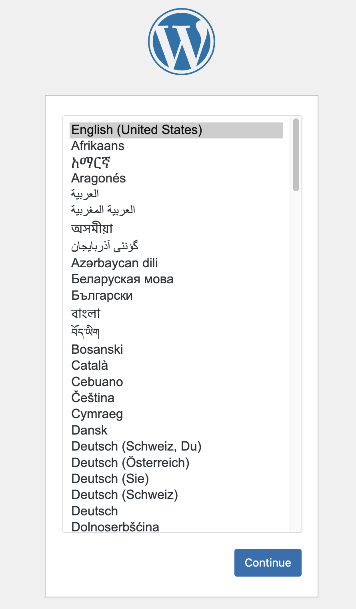

# Docker 🐳

- 모든 컨테이너는 격리된 환경이다
- 내부에서는 파일 시스템, 사용자 계정, 호스트 네임, 프로세스, 네트워크 등에 대해서 격리되어있다.
~~~bash
ubuntu@ip-172-31-39-149:~$ docker system df
TYPE            TOTAL     ACTIVE    SIZE      RECLAIMABLE
Images          5         1         1.035GB   848.1MB (81%)
Containers      1         1         1.095kB   0B (0%)
Local Volumes   0         0         0B        0B
Build Cache     0         0         0B        0B

ubuntu@ip-172-31-39-149:~$ docker network ls
NETWORK ID     NAME      DRIVER    SCOPE
304a756c0ba6   bridge    bridge    local
626204ee5a83   host      host      local
20c8e9a60de7   none      null      local
~~~
- 웹서비스, DB는 모두 컨테이너 안의 고립된 환경에서만 동작한다
- 독립되어 있으므로 외부와 연결해서 사용해야 한다
- 내부와 외부를 연결해야 하는 서비스 많다
~~~bash
docker run
# 데몬화
# 🐳 도커 데몬 : 도커 프로세스가 시행되어 서버로서 입력을 받을 준비가 된 상태
-d
# 이름 정하는 옵션
—name my-web
# 🐳 -p 옵션
# 호스트와 컨테이너 간의 포트 배포(publish)/바인드(bind)를 위해서 사용
# if -p 80:8000:
# container 내부에서 8000 포트로 리스닝하고 있는 HTTP 서버를 호스트에서 80 포트로 접속할 수 있게 해줌
-p <host port>:<container port>
# 🐳 -v 옵션
# 호스트와 컨테이너의 볼륨(volume) 설정을 위해 사용
# 호스트의 디렉터리와 컨테이너의 디렉터리 공유(마운트, mount)
# 여러개의 -v 옵션을 사용하여 여러 파일, 디렉터리를 공유 가능
-v <host path>:<container path>
-e <환경변수>=<설정값>
~~~

## 도커 디버깅
1. 안에 들어가서 보기
~~~bash
# 🐳 -it 옵션
# 컨테이너를 종료하지 않은 채로, 터미널의 입력을 계속해서 컨테이너로 전달
# 상호작용이 가능한 쉘이나 CLI 도구를 사용 할 때 유용
docker exec -it <container id> bash
~~~
2. 로그 보기
~~~bash
docker logs <container id>
~~~

## 로컬 파일 컨테이너 안으로 복사하기
- docker cp \<host path> \<container id>:\<container path>
~~~bash
ubuntu@ip-172-31-39-149:~/SESAC$ touch index.html
ubuntu@ip-172-31-39-149:~/SESAC$ echo "<h1>Hello World</h1>" > index.html
ubuntu@ip-172-31-39-149:~/SESAC$ cat index.html
<h1>Hello World</h1>
# 아래는 컨테이너 id 대신 컨테이너 name을 사용한 예시
# 현재 폴더의 index.html을 복사하는 것
ubuntu@ip-172-31-39-149:~/SESAC$ docker cp index.html my-web:/usr/share/nginx/html/index.html
~~~
- 같은 경로에 여러번 복사하면 덮어씌워짐

## 도커 inspect
- docker inspect \<container id>
- 컨테이너의 정보를 자세하게 알려줌
~~~bash
ubuntu@ip-172-31-39-149:~/SESAC$ docker inspect my-web
[
    {
        "Id": "b0091606482f2778567f451d9c0dca31d7054ef5682d6782f84b298fb9dbb1ac",
        "Created": "2023-08-31T06:00:35.890228801Z",
        "Path": "/docker-entrypoint.sh",
        "Args": [
            "nginx",
            "-g",
            "daemon off;"
        ],
        "State": {
            "Status": "running",
            "Running": true,
            "Paused": false,
            "Restarting": false,
            # 컨테이너 메모리 제한 초과, 메모리 부족으로 OOM Killer에 의해 종료.
            "OOMKilled": false,
            "Dead": false,
            # Process 식별자
            "Pid": 83465,
            "ExitCode": 0,
            "Error": "",
            "StartedAt": "2023-08-31T06:00:36.358643097Z",
            "FinishedAt": "0001-01-01T00:00:00Z"
        },
        "Image": "sha256:eea7b3dcba7ee47c0d16a60cc85d2b977d166be3960541991f3e6294d795ed24",
        "ResolvConfPath": "/var/lib/docker/containers/b0091606482f2778567f451d9c0dca31d7054ef5682d6782f84b298fb9dbb1ac/resolv.conf",
        "HostnamePath": "/var/lib/docker/containers/b0091606482f2778567f451d9c0dca31d7054ef5682d6782f84b298fb9dbb1ac/hostname",
        "HostsPath": "/var/lib/docker/containers/b0091606482f2778567f451d9c0dca31d7054ef5682d6782f84b298fb9dbb1ac/hosts",
        "LogPath": "/var/lib/docker/containers/b0091606482f2778567f451d9c0dca31d7054ef5682d6782f84b298fb9dbb1ac/b0091606482f2778567f451d9c0dca31d7054ef5682d6782f84b298fb9dbb1ac-json.log",
        "Name": "/my-web",
        "RestartCount": 0,
        # docker storage driver
        "Driver": "overlay2",
        "Platform": "linux",
        "MountLabel": "",
        "ProcessLabel": "",
        "AppArmorProfile": "docker-default",
        "ExecIDs": null,
        "HostConfig": {
            "Binds": null,
            "ContainerIDFile": "",
            "LogConfig": {
                "Type": "json-file",
                "Config": {}
            },
            "NetworkMode": "default",
            "PortBindings": {
                "80/tcp": [
                    {
                        "HostIp": "",
                        "HostPort": "80"
                    }
                ]
            },
            "RestartPolicy": {
                "Name": "no",
                "MaximumRetryCount": 0
            },
            "AutoRemove": false,
            "VolumeDriver": "",
            "VolumesFrom": null,
            "CapAdd": null,
            "CapDrop": null,
            "CgroupnsMode": "host",
            # Domein Name System
            "Dns": [],
            "DnsOptions": [],
            "DnsSearch": [],
            "ExtraHosts": null,
            "GroupAdd": null,
            "IpcMode": "private",
            "Cgroup": "",
            "Links": null,
            "OomScoreAdj": 0,
            "PidMode": "",
            "Privileged": false,
            "PublishAllPorts": false,
            "ReadonlyRootfs": false,
            "SecurityOpt": null,
            "UTSMode": "",
            "UsernsMode": "",
            "ShmSize": 67108864,
            "Runtime": "runc",
            "ConsoleSize": [
                0,
                0
            ],
            "Isolation": "",
            "CpuShares": 0,
            "Memory": 0,
            "NanoCpus": 0,
            "CgroupParent": "",
            "BlkioWeight": 0,
            "BlkioWeightDevice": [],
            "BlkioDeviceReadBps": null,
            "BlkioDeviceWriteBps": null,
            "BlkioDeviceReadIOps": null,
            "BlkioDeviceWriteIOps": null,
            "CpuPeriod": 0,
            "CpuQuota": 0,
            "CpuRealtimePeriod": 0,
            "CpuRealtimeRuntime": 0,
            "CpusetCpus": "",
            "CpusetMems": "",
            "Devices": [],
            "DeviceCgroupRules": null,
            "DeviceRequests": null,
            "KernelMemory": 0,
            "KernelMemoryTCP": 0,
            "MemoryReservation": 0,
            "MemorySwap": 0,
            "MemorySwappiness": null,
            "OomKillDisable": false,
            "PidsLimit": null,
            "Ulimits": null,
            "CpuCount": 0,
            "CpuPercent": 0,
            "IOMaximumIOps": 0,
            "IOMaximumBandwidth": 0,
            "MaskedPaths": [
                "/proc/asound",
                "/proc/acpi",
                "/proc/kcore",
                "/proc/keys",
                "/proc/latency_stats",
                "/proc/timer_list",
                "/proc/timer_stats",
                "/proc/sched_debug",
                "/proc/scsi",
                "/sys/firmware"
            ],
            "ReadonlyPaths": [
                "/proc/bus",
                "/proc/fs",
                "/proc/irq",
                "/proc/sys",
                "/proc/sysrq-trigger"
            ]
        },
        "GraphDriver": {
            "Data": {
                "LowerDir": "/var/lib/docker/overlay2/148f267b28674071728e0742c1e75987d123064dc3c0173c1e65af9b43d2d3cc-init/diff:/var/lib/docker/overlay2/5ee697375b202c8d1dcf33f0c3f807acdb1b0d5db09a833a83c4ec85a3aef95b/diff:/var/lib/docker/overlay2/022d8fa746009ae66e64ce974b97f3069e7927dac43e036cb3e90408532e18bb/diff:/var/lib/docker/overlay2/918fded5a3949619f836d1ff8b25dbc395f83dbe63e78635dc1cc4fe23bf3e6d/diff:/var/lib/docker/overlay2/3a569ff89e9a1b6871fdeadcc4f1de738edc6f2540076d78bc5dfe1a2fb2efbc/diff:/var/lib/docker/overlay2/57cd5314894a89d46e3564f5c57c0d5bcaae973f7b966e443bbc71b313117105/diff:/var/lib/docker/overlay2/d74bc881934766c141ba502ae5a9cb321f22d01231a452477646e7ddaa339af7/diff:/var/lib/docker/overlay2/8a1ca4c1502c94e98c181f156613398514b1f4f35df18d9b485d34d8ad3d70e1/diff",
                "MergedDir": "/var/lib/docker/overlay2/148f267b28674071728e0742c1e75987d123064dc3c0173c1e65af9b43d2d3cc/merged",
                "UpperDir": "/var/lib/docker/overlay2/148f267b28674071728e0742c1e75987d123064dc3c0173c1e65af9b43d2d3cc/diff",
                "WorkDir": "/var/lib/docker/overlay2/148f267b28674071728e0742c1e75987d123064dc3c0173c1e65af9b43d2d3cc/work"
            },
            "Name": "overlay2"
        },
        "Mounts": [],
        "Config": {
            "Hostname": "b0091606482f",
            "Domainname": "",
            "User": "",
            "AttachStdin": false,
            "AttachStdout": false,
            "AttachStderr": false,
            "ExposedPorts": {
                "80/tcp": {}
            },
            "Tty": false,
            "OpenStdin": false,
            "StdinOnce": false,
            "Env": [
                "PATH=/usr/local/sbin:/usr/local/bin:/usr/sbin:/usr/bin:/sbin:/bin",
                "NGINX_VERSION=1.25.2",
                "NJS_VERSION=0.8.0",
                "PKG_RELEASE=1~bookworm"
            ],
            "Cmd": [
                "nginx",
                "-g",
                "daemon off;"
            ],
            "Image": "nginx",
            "Volumes": null,
            "WorkingDir": "",
            "Entrypoint": [
                "/docker-entrypoint.sh"
            ],
            "OnBuild": null,
            "Labels": {
                "maintainer": "NGINX Docker Maintainers <docker-maint@nginx.com>"
            },
            "StopSignal": "SIGQUIT"
        },
        "NetworkSettings": {
            "Bridge": "",
            "SandboxID": "e1b0a3f0c32fd90d7becd2af468a3ebd9f5d19e918d0b3e5a663313f51935795",
            "HairpinMode": false,
            "LinkLocalIPv6Address": "",
            "LinkLocalIPv6PrefixLen": 0,
            "Ports": {
                "80/tcp": [
                    {
                        "HostIp": "0.0.0.0",
                        "HostPort": "80"
                    },
                    {
                        "HostIp": "::",
                        "HostPort": "80"
                    }
                ]
            },
            "SandboxKey": "/var/run/docker/netns/e1b0a3f0c32f",
            "SecondaryIPAddresses": null,
            "SecondaryIPv6Addresses": null,
            "EndpointID": "dc5de3a424b03ef01cd5fa4ce9a67e32df4c2e05bb1172a4a101f3c78d51767e",
            "Gateway": "172.17.0.1",
            "GlobalIPv6Address": "",
            "GlobalIPv6PrefixLen": 0,
            "IPAddress": "172.17.0.2",
            "IPPrefixLen": 16,
            "IPv6Gateway": "",
            "MacAddress": "02:42:ac:11:00:02",
            "Networks": {
                "bridge": {
                    "IPAMConfig": null,
                    "Links": null,
                    "Aliases": null,
                    "NetworkID": "304a756c0ba6f70c88e09b725a71e1176d3553bf509f261a833e0f5d8aec206a",
                    "EndpointID": "dc5de3a424b03ef01cd5fa4ce9a67e32df4c2e05bb1172a4a101f3c78d51767e",
                    "Gateway": "172.17.0.1",
                    "IPAddress": "172.17.0.2",
                    "IPPrefixLen": 16,
                    "IPv6Gateway": "",
                    "GlobalIPv6Address": "",
                    "GlobalIPv6PrefixLen": 0,
                    "MacAddress": "02:42:ac:11:00:02",
                    "DriverOpts": null
                }
            }
        }
    }
]
~~~

## 도커 상태 저장을 위한 볼륨 바인딩
~~~bash
docker run
# 데몬화해서
-d
# 이름은 my-web으로
--name my-web
# 볼륨 바인딩
-v /home/ubuntu/sesac/html:/usr/share/nginx/html
# 컨테이너의 80번 포트를 호스트의 81번 포트로
-p 81:80
# nginx 최신 버전으로
nginx:latest
~~~

## MySQL 볼륨 바인딩
~~~bash
docker volume create my-db
my-db
docker volume ls
DRIVER    VOLUME NAME
local     my-db

docker run
-d
--name my-mysql
-e MYSQL_ALLOW_EMPTY_PASSWORD=true
-v my-db:/var/lib/mysql
-p 3306:3306
mysql:8.0
~~~

## wordpress(홈페이지/블로그 사이트 개발하는 도구) 컨테이너 띄우기
~~~bash
docker run 
-d
-p 8000:80
# my-mysql 컨테이너와 WORDPRESS_DB_HOST인 my-db 연결
--link my-mysql:my-db
-e WORDPRESS_DB_HOST=my-db
-e WORDPRESS_DB_USER=wp
-e WORDPRESS_DB_PASSWORD=mypassword
-e WORDPRESS_DB_NAME=wp
wordpress

# ✅ mysql 설정
mysql
# 로컬 호스트로 DB 서버 호스트 지정
-h 127.0.0.1
# 사용자 이름으로 root를 사용하여 접속
-u root
~~~

~~~sql
-- wordpress 환경설정 때 지정한 이름과 동일하게
CREATE DATABASE wp;
-- wp라는 유저 생성
-- '%' : 어떤 호스트든 접속 가능
CREATE USER wp@'%' IDENTIFIED BY 'mypassword';

-- ✅ 권한 설정
-- 모든 권한 부여
GRANT ALL PRIVILEGES
-- wp 데이터베이스의 모든 것
ON wp.*
-- wp라는 유저에게
TO wp@'%'
-- wp 유저가 다른 사용자에게도 권한 부여 가능
WITH GRANT OPTION;

-- 사용자 권한과 관련된 정보를 다시 불러오고, 현재 실행 중인 MySQL 서버에 새로운 권한 설정을 적용
FLUSH PRIVILEGES;
~~~

- http://<공인 IP>:8000/ 으로 접속하면 아래와 같은 화면 확인 가능! 

## 도커 이미지 만들기
- vscode에서 원하는 폴더에 Dockerfile 생성
~~~dockerfile
📂 Dockerfile
FROM ubuntu:20.04

<!-- ENTRYPOINT : 컨테이너 시작 시 출발점 (명령어) -->
ENTRYPOINT ["echo", "hello, sesac"]
~~~

~~~bash
# 🐳 도커 빌드
# . : build context : 도커파일이 있는 경로
ubuntu@ip-172-31-39-149:~/sesac/1.hello$ docker build .
Sending build context to Docker daemon  2.048kB
# Docker 파일에 작성한 명령 순차적으로 실행하는 것 확인 간,ㅇ
Step 1/2 : FROM ubuntu:20.04
 ---> 6df894023726
Step 2/2 : ENTRYPOINT ["echo", "hello, sesac"]
 ---> Running in 01d57674d982
Removing intermediate container 01d57674d982
 ---> 9fdd513c5622
Successfully built 9fdd513c5622

# 이름과 함께 빌드
# -t : 도커 이미지에 이름 부여(태그)
docker build -t myecho:1.0 .

# -f : 어떤 도커파일을 사용하는 건지 명시 할 수도 있음

# local에 방금 만든 이미지 확인 가능!
docker images
REPOSITORY   TAG       IMAGE ID       CREATED         SIZE
myecho       1.0       9fdd513c5622   3 minutes ago   72.8MB
~~~

## 도커 컨테이너 만들기
~~~bash
docker run myecho
Unable to find image 'myecho:latest' locally
docker: Error response from daemon: pull access denied for myecho, repository does not exist or may require 'docker login': denied: requested access to the resource is denied.
# 🚨 latest 버전의 이미지가 없어서 버전 명시해 주어야 오류 발생하지 않음

ubuntu@ip-172-31-39-149:~/sesac/1.hello$ docker run myecho:1.0
hello, sesac

# ubuntu 18.04
# alpine 리눅스 설치 결과
ubuntu@ip-172-31-39-149:~/sesac/1.hello$ docker images
REPOSITORY   TAG       IMAGE ID       CREATED          SIZE
# alpine 용량 제일 적음
myecho       2.0       129077f2b2ed   6 seconds ago    7.34MB
myecho       1.1       532d85f5bb38   2 minutes ago    63.2MB
myecho       1.0       9fdd513c5622   12 minutes ago   72.8MB
~~~
- 모든 이미지는 불변(immutable)하기 때문에 베이스 이미지로 시작하여 + 기능1 + 기능2 ➡️ 기능 더해감
- VM의 우분투는 2GB 가까이 되지만 컨테이너 우분투는 용량이 작은 이유❓
  - ❗️ kernel도 GUI 없이 기본적인 파일시스템과 바이너리 최소한의 기능만 갖고 있기 때문에
- 베이스 이미지 선택에 따라 나의 이미지 사이즈가 달라진다
- 리눅스 중 가장 용량 작은 것❓ 알파인 리눅스

## 직접 우분투 nginx 만들기
~~~dockerfile
📂 Dockerfile
FROM ubuntu:20.04

RUN apt update
# Dockerfile 내에서 사용자와의 인터렉션이 있으면 안 됨
# -y : 사용자에게 묻지 않고 설치하도록
RUN apt install nginx -y

ENTRYPOINT [ "nginx" ]
~~~

~~~bash
docker build -t mynginx:0.1 .
docker run mynginx:0.1

CONTAINER ID   IMAGE          COMMAND                  CREATED              STATUS                          PORTS                                                  NAMES
9f76dd2d1318   mynginx:0.1    "nginx"                  About a minute ago   Exited (0) About a minute ago 
~~~
- nginx 종료됨
  - 이유 확인을 위해 로그 확인하려고 해도 로그도 남지 않고 종료되어서 exec로 들어갈수도 없음

- Dockerfile로 실행한 내용 터미널에서 직접 실행해보기!
~~~bash
docker run -it ubuntu:20.04 bash
apt update
apt install nginx -y
nginx
# 종료
# ps -a : 죽은 게 아니라 백그라운드로 돌아감
# 호스트에서 실행할 때에는 터미널 멈춤 없이 백그라운드로 돌아가고 있는 게 사용자에게 좋기 때문에...
# 옵션으로 데몬 오프를 주면 해결됨
~~~

- 내가 만들고 싶은 서비스가 데몬 형태라면 ➡️ 프로세스가 종료되면 안된다
  - python app.py가 계속 실행고 있어야 서비스를 사용할 수 있는 것과 동일
~~~dockerfile
# 📂 Dockerfile
FROM ubuntu:20.04

RUN apt update
RUN apt install nginx -y

ENTRYPOINT ["nginx", "-g", "daemon off;"]
~~~
~~~bash
# Dockerfile 실행
ubuntu@ip-172-31-39-149:~/sesac/2.nginx$ docker run -d -p 80:80 mynginx:2.1
672d1dddc8f488078189de77ad3a33bbe7540f7dd702417b5a355ba5810401dd
ubuntu@ip-172-31-39-149:~/sesac/2.nginx$ curl localhost
<!DOCTYPE html>
<html>
<head>
<title>Welcome to nginx!</title>

</head>
<body>
<h1>Welcome to nginx!</h1>

If you see this page, the nginx web server is successfully installed and
working. Further configuration is required.

For online documentation and support please refer to
<a href="http://nginx.org/">nginx.org</a>. 
Commercial support is available at
<a href="http://nginx.com/">nginx.com</a>.

<em>Thank you for using nginx.</em>

</body>
</html>
~~~

## 내 파일 nginx에 올리기!
~~~dockerfile
# 📂 Dockerfile
FROM ubuntu:20.04

RUN apt update
RUN apt install nginx -y

COPY index.html /var/www/html/index.html
COPY user.html /var/www/html/user.html

ENTRYPOINT ["nginx", "-g", "daemon off;"]
~~~
~~~bash
docker build -t mynginx:2.2 .
docker run -d -p 80:80 mynginx:2.2
~~~
- 이름을 안 주고 이미지를 만들면 <none> <none>
- 이름이 중복되어 이전 이름을 뺏기면 <none> <none>
- none ➡️ dangling image : 더이상 참조되지 않는, 필요 없는 이미지가 됨

## dangling image
~~~bash
# dangling image 조회
docker images -f "dangling=true"
# dangling image 삭제
# -q 옵션 : 이미지의 id 값만 출력
docker rmi $(docker images -f "dangling=true" -q)
~~~

## image 기록 확인
~~~bash
docker history mynginx:2.2

# layer(층) 형태로 이미지가 생성된 것을 확인할 수 있음
IMAGE          CREATED          CREATED BY                                      SIZE      COMMENT
6fab5ba5e7c8   9 minutes ago    /bin/sh -c #(nop)  ENTRYPOINT ["nginx" "-g" …   0B
5d0082610bb5   9 minutes ago    /bin/sh -c #(nop) COPY file:e38d7c98079e3073…   267B
887fd54e3445   9 minutes ago    /bin/sh -c #(nop) COPY file:c0d6d03346a0d413…   306B
1feaa0c6e4c8   29 minutes ago   /bin/sh -c apt install nginx -y                 59.3MB
cc5b10b0c236   29 minutes ago   /bin/sh -c apt update                           45.6MB
~~~

## 레이어 줄이기 - && \ 사용!
~~~dockerfile
# 📂 Dockerfile
FROM ubuntu:20.04

RUN apt update && \
    apt install nginx -y && \
    apt install curl -y && \
    apt install vim -y

# 디렉토리의 모든 내용을 workdir로 복사
WORKDIR /var/www/html

COPY . . 

ENTRYPOINT ["nginx", "-g", "daemon off;"]
~~~

## 파이썬 파일 실행 1️⃣
~~~python
📂 app.py
from flask import Flask, render_template

app = Flask(__name__)

@app.route('/')
def main():
  color = "yello"
  return render_template("index.html", color=color)

if __name__ == "__main__" :
  app.run(host='0.0.0.0')
~~~

~~~dockerfile
FROM python:3.8

RUN pip install flask

WORKDIR /app
COPY . .

ENTRYPOINT ["python", "app.py"]
~~~

~~~bash
docker build -t myapp:0.1 .
docker run -d -p 81:5000 myapp:0.1
ubuntu@ip-172-31-39-149:~/sesac/3.flask$ docker images
REPOSITORY   TAG       IMAGE ID       CREATED              SIZE
myapp        0.1       05f5b3609974   About a minute ago   1.01GB
~~~
- 🚨 문제
- 용량이 너무 큼
- 대체
  - python:3.8-alpine → 명령어가 다르기 때문에 어려울 수 있음
  - python:3.8-slim → 지금 익숙하게 쓰기 좋음
  - 파이썬 뿐만 아니라 다른 것들에도 가벼운 버전 존재
- python 파일에 수정이 있을 때마다 새로 build, run 해줘야 함
  - 환경변수를 통해 가져오도록 만들기

## 파이썬 파일 실행 2️⃣
~~~python
import os
from flask import Flask, render_template

app = Flask(__name__)

color = os.environ.get('APP_COLOR')

@app.route('/')
def main():
  return render_template("index.html", color=color)

if __name__ == "__main__" :
  app.run(host='0.0.0.0')
~~~
- requirements.txt 파일 : 사용할 라이브러리를 관리하고 편하게 다운로드 받을 수 있음
~~~txt
<!-- 📂 requirements.txt -->
flask==2.0.1
~~~
~~~dockerfile
# 📂 Dockerfile
FROM python:3.8

WORKDIR /app
COPY . .

RUN pip install -r requirements.txt

ENTRYPOINT ["python", "app.py"]
~~~
~~~bash
docker build -t myapp:1.0 .
docker run -d -p 81:5000 -e APP_COLOR="red" myapp:1.0
~~~